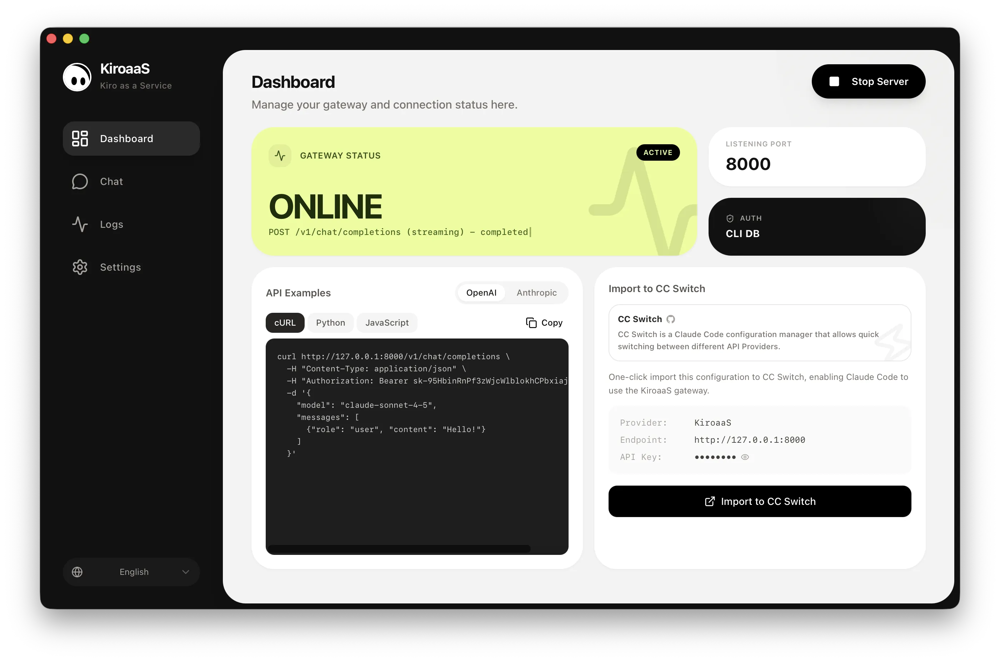

# KiroaaS

<p align="center">
  
</p>

<h3 align="center">Kiro as a Service</h3>
<p align="center">Turn Kiro into an OpenAI-compatible and Anthropic-compatible API with one click</p>

<p align="center">
  🇺🇸 English • <a href="docs/README_zh.md">🇨🇳 中文</a> • <a href="docs/README_ja.md">🇯🇵 日本語</a> • <a href="docs/README_ko.md">🇰🇷 한국어</a> • <a href="docs/README_ru.md">🇷🇺 Русский</a> • <a href="docs/README_es.md">🇪🇸 Español</a> • <a href="docs/README_pt.md">🇧🇷 Português</a> • <a href="docs/README_id.md">🇮🇩 Indonesia</a>
</p>

<p align="center">
  <a href="https://opensource.org/licenses/AGPL-3.0"></a>
  
  <a href="http://makeapullrequest.com"></a>
</p>

<p align="center">
  
</p>

---

KiroaaS (Kiro as a Service) is a desktop gateway that exposes Kiro's AI models through a local OpenAI-compatible and Anthropic-compatible API. Use your favorite AI tools, libraries, and applications with Kiro - no code changes required.

## ✨ Features

| Feature | Description |
|---------|-------------|
| 🔌 **OpenAI-compatible API** | `/v1/chat/completions` endpoint for OpenAI SDK |
| 🔌 **Anthropic-compatible API** | `/v1/messages` endpoint for Anthropic SDK |
| 🌐 **VPN/Proxy Support** | HTTP/SOCKS5 proxy for restricted networks |
| 🧠 **Extended Thinking** | Reasoning support exclusive to our project |
| 👁️ **Vision Support** | Send images to model |
| 🛠️ **Tool Calling** | Supports function calling |
| 💬 **Built-in Chat** | Test your setup with the integrated chat interface |
| 📡 **Streaming** | Full SSE streaming support |
| 🔄 **Retry Logic** | Automatic retries on errors (403, 429, 5xx) |
| 🔐 **Smart Token Management** | Automatic refresh before expiration |
| 🌍 **Multi-language UI** | English, 中文, 日本語, 한국어, Русский, Español, Português, Indonesia |
| 🔗 **CC Switch Integration** | One-click import to [CC Switch](https://github.com/yiGmMk/cc-switch) for Claude Code |
| 🔄 **Auto Update** | Built-in update checker keeps you on the latest version |

## 📦 Installation

### Download

Download the latest release from [GitHub Releases](https://github.com/hnewcity/KiroaaS/releases):

| Platform | Architecture | Download |
|----------|--------------|----------|
| macOS | Apple Silicon (M1/M2/M3) | [KiroaaS_aarch64.dmg](https://github.com/hnewcity/KiroaaS/releases) |
| macOS | Intel | [KiroaaS_x64.dmg](https://github.com/hnewcity/KiroaaS/releases) |

> Windows and Linux support coming soon.

### Build from Source

```bash
# Clone the repo
git clone https://github.com/hnewcity/KiroaaS.git
cd KiroaaS

# Install dependencies
npm install
cd python-backend && pip install -r requirements.txt && cd ..

# Run in dev mode
npm run tauri:dev

# Or build for production
npm run tauri:build
```

## 🚀 Quick Start

1. **Launch** KiroaaS
2. **Configure** your Kiro credentials (auto-detected from Kiro CLI if available)
3. **Generate** a Proxy API Key (or use one provided by your administrator)
4. **Start** the server
5. **Use** `http://localhost:8000` as your OpenAI/Anthropic API endpoint

### Example: cURL

```bash
curl http://localhost:8000/v1/chat/completions \
  -H "Content-Type: application/json" \
  -H "Authorization: Bearer YOUR_PROXY_API_KEY" \
  -d '{
    "model": "claude-sonnet-4-5",
    "messages": [{"role": "user", "content": "Hello!"}]
  }'
```

### Example: Python (OpenAI SDK)

```python
from openai import OpenAI

client = OpenAI(
    base_url="http://localhost:8000/v1",
    api_key="YOUR_PROXY_API_KEY"
)

response = client.chat.completions.create(
    model="claude-sonnet-4-5",
    messages=[{"role": "user", "content": "Hello!"}]
)
print(response.choices[0].message.content)
```

### Example: JavaScript (OpenAI SDK)

```javascript
import OpenAI from 'openai';

const client = new OpenAI({
  baseURL: 'http://localhost:8000/v1',
  apiKey: 'YOUR_PROXY_API_KEY',
});

const response = await client.chat.completions.create({
  model: 'claude-sonnet-4-5',
  messages: [{ role: 'user', content: 'Hello!' }],
});
console.log(response.choices[0].message.content);
```

## 🔌 Works With

KiroaaS is compatible with popular AI tools and libraries:

| Category | Tools |
|----------|-------|
| **Python** | OpenAI SDK, Anthropic SDK, LangChain, LlamaIndex |
| **JavaScript** | OpenAI Node.js SDK, Anthropic SDK, Vercel AI SDK |
| **IDE Extensions** | Cursor, Continue, Cline, Claude Code |
| **Chat Apps** | ChatGPT-Next-Web, LobeChat, Open WebUI |

## ⚙️ Configuration

### Authentication Methods

KiroaaS supports multiple authentication methods:

| Method | Description |
|--------|-------------|
| **Kiro CLI Database** | Auto-detect credentials from Kiro CLI (recommended) |
| **Credentials File** | Use a JSON credentials file |
| **Refresh Token** | Manually enter your refresh token |

### Server Settings

| Option | Default | Description |
|--------|---------|-------------|
| Host | `127.0.0.1` | Server bind address |
| Port | `8000` | Server port |
| Proxy API Key | - | Required key for API authentication |

### Advanced Settings

| Option | Description |
|--------|-------------|
| VPN/Proxy URL | HTTP/SOCKS5 proxy for network restrictions |
| First Token Timeout | Timeout for initial response (seconds) |
| Streaming Read Timeout | Timeout for streaming responses (seconds) |

## 🛠️ Tech Stack

| Layer | Technology |
|-------|------------|
| **Frontend** | React + TypeScript + Tailwind CSS |
| **Desktop** | Tauri (Rust) |
| **Backend** | Python + FastAPI |

## 🤝 Contributing

Contributions are welcome! Feel free to:

- 🐛 Report bugs via [GitHub Issues](https://github.com/hnewcity/KiroaaS/issues)
- 💡 Suggest features
- 🔧 Submit pull requests
- 🌍 Help with translations

## 📄 License

[AGPL-3.0](LICENSE) © KiroaaS Contributors
