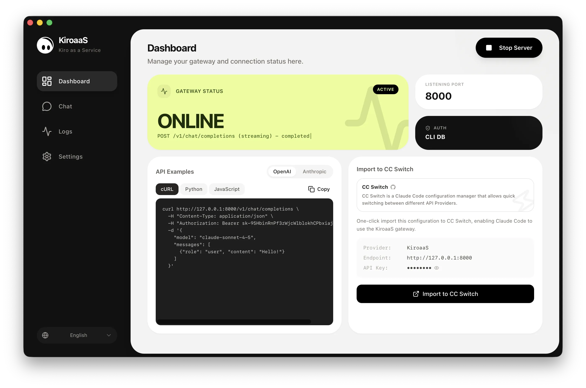
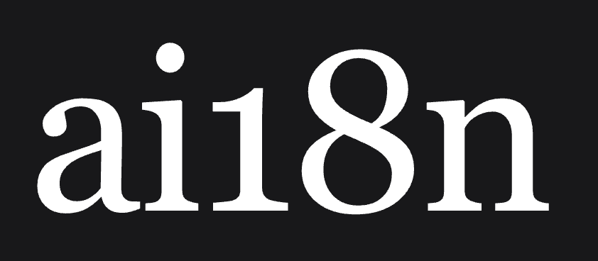

# KiroaaS

<p align="center">
  
</p>

<h3 align="center">Kiro as a Service</h3>
<p align="center">Convierte Kiro en una API compatible con OpenAI y Anthropic con un solo clic</p>

<p align="center">
  <a href="../README.md">🇺🇸 English</a> • <a href="README_zh.md">🇨🇳 中文</a> • <a href="README_ja.md">🇯🇵 日本語</a> • <a href="README_ko.md">🇰🇷 한국어</a> • <a href="README_ru.md">🇷🇺 Русский</a> • 🇪🇸 Español • <a href="README_pt.md">🇧🇷 Português</a> • <a href="README_id.md">🇮🇩 Indonesia</a>
</p>

<p align="center">
  <a href="https://opensource.org/licenses/AGPL-3.0"></a>
  
  <a href="http://makeapullrequest.com"></a>
</p>

<p align="center">
  
</p>

---

## ❤️ Patrocinador

<table>
<tr>
<td width="180"><a href="https://ai18n.chat"></a></td>
<td>¡Gracias a <a href="https://ai18n.chat">ai18n</a> por patrocinar este proyecto! ai18n es un proveedor de servicios de relay de API confiable y eficiente, que ofrece relay de modelos Claude para OpenClaw, Claude Code, Codex, Gemini y más.</td>
</tr>
</table>

---

> ~~**📢 Aviso:** La próxima versión corregirá la compatibilidad con Claude Code v2.1.69+, que envía bloques de contenido `tool_reference` dentro de mensajes `tool_result` al usar el mecanismo de herramientas diferidas ToolSearch.~~ ✅ Corregido

KiroaaS (Kiro as a Service) es una pasarela de escritorio que expone los modelos de IA de Kiro a través de una API local compatible con OpenAI y Anthropic. Usa tus herramientas, bibliotecas y aplicaciones de IA favoritas con Kiro, sin necesidad de cambiar el código.

## ✨ Características

| Característica | Descripción |
|----------------|-------------|
| 🔌 **API compatible con OpenAI** | Endpoint `/v1/chat/completions` para OpenAI SDK |
| 🔌 **API compatible con Anthropic** | Endpoint `/v1/messages` para Anthropic SDK |
| 🌐 **Soporte VPN/Proxy** | Proxy HTTP/SOCKS5 para redes restringidas |
| 🧠 **Pensamiento extendido** | Soporte de razonamiento exclusivo de nuestro proyecto |
| 👁️ **Soporte de visión** | Envía imágenes al modelo |
| 🛠️ **Llamada de herramientas** | Soporta llamadas a funciones |
| 💬 **Chat integrado** | Prueba tu configuración con la interfaz de chat integrada |
| 📡 **Streaming** | Soporte completo de streaming SSE |
| 🔄 **Lógica de reintentos** | Reintentos automáticos en errores (403, 429, 5xx) |
| 🔐 **Gestión inteligente de tokens** | Actualización automática antes de expirar |
| 🌍 **Interfaz multilingüe** | English, 中文, 日本語, 한국어, Русский, Español, Português, Indonesia |
| 🔗 **Integración con CC Switch** | Importación con un clic a [CC Switch](https://github.com/farion1231/cc-switch) para Claude Code |
| 🔄 **Actualización automática** | Verificador de actualizaciones integrado |

## 📦 Instalación

### Descargar

Descarga la última versión desde [GitHub Releases](https://github.com/hnewcity/KiroaaS/releases):

| Plataforma | Arquitectura | Descargar |
|------------|--------------|-----------|
| macOS | Apple Silicon (M1/M2/M3) | [KiroaaS_aarch64.dmg](https://github.com/hnewcity/KiroaaS/releases) |
| macOS | Intel | [KiroaaS_x64.dmg](https://github.com/hnewcity/KiroaaS/releases) |
| Windows | x64 | [KiroaaS_x64-setup.exe](https://github.com/hnewcity/KiroaaS/releases) |

> Soporte para Linux próximamente.

### Compilar desde el código fuente

```bash
# Clonar el repositorio
git clone https://github.com/hnewcity/KiroaaS.git
cd KiroaaS

# Instalar dependencias
npm install
cd python-backend && pip install -r requirements.txt && cd ..

# Ejecutar en modo desarrollo
npm run tauri:dev

# O compilar para producción
npm run tauri:build
```

## 🚀 Inicio rápido

1. **Inicia** KiroaaS
2. **Configura** tus credenciales de Kiro (se detectan automáticamente si Kiro CLI está instalado)
3. **Genera** una clave API de proxy (o usa una proporcionada por tu administrador)
4. **Inicia** el servidor
5. **Usa** `http://localhost:8000` como tu endpoint de API OpenAI/Anthropic

### Ejemplo: cURL

```bash
curl http://localhost:8000/v1/chat/completions \
  -H "Content-Type: application/json" \
  -H "Authorization: Bearer YOUR_PROXY_API_KEY" \
  -d '{
    "model": "claude-sonnet-4-6",
    "messages": [{"role": "user", "content": "¡Hola!"}]
  }'
```

### Ejemplo: Python (OpenAI SDK)

```python
from openai import OpenAI

client = OpenAI(
    base_url="http://localhost:8000/v1",
    api_key="YOUR_PROXY_API_KEY"
)

response = client.chat.completions.create(
    model="claude-sonnet-4-6",
    messages=[{"role": "user", "content": "¡Hola!"}]
)
print(response.choices[0].message.content)
```

### Ejemplo: JavaScript (OpenAI SDK)

```javascript
import OpenAI from 'openai';

const client = new OpenAI({
  baseURL: 'http://localhost:8000/v1',
  apiKey: 'YOUR_PROXY_API_KEY',
});

const response = await client.chat.completions.create({
  model: 'claude-sonnet-4-6',
  messages: [{ role: 'user', content: '¡Hola!' }],
});
console.log(response.choices[0].message.content);
```

## 🔌 Compatible con

KiroaaS es compatible con herramientas y bibliotecas de IA populares:

| Categoría | Herramientas |
|-----------|--------------|
| **Python** | OpenAI SDK, Anthropic SDK, LangChain, LlamaIndex |
| **JavaScript** | OpenAI Node.js SDK, Anthropic SDK, Vercel AI SDK |
| **Extensiones IDE** | Cursor, Continue, Cline, Claude Code |
| **Apps de chat** | ChatGPT-Next-Web, LobeChat, Open WebUI |

## ⚙️ Configuración

### Métodos de autenticación

KiroaaS soporta múltiples métodos de autenticación:

| Método | Descripción |
|--------|-------------|
| **Base de datos Kiro CLI** | Detección automática de credenciales desde Kiro CLI (recomendado) |
| **Archivo de credenciales** | Usar un archivo JSON de credenciales |
| **Token de actualización** | Ingresar manualmente el token de actualización |

### Configuración del servidor

| Opción | Predeterminado | Descripción |
|--------|----------------|-------------|
| Host | `127.0.0.1` | Dirección de enlace del servidor |
| Puerto | `8000` | Puerto del servidor |
| Clave API de proxy | - | Clave requerida para autenticación API |

### Configuración avanzada

| Opción | Descripción |
|--------|-------------|
| URL VPN/Proxy | Proxy HTTP/SOCKS5 para restricciones de red |
| Timeout del primer token | Timeout para respuesta inicial (segundos) |
| Timeout de lectura streaming | Timeout para respuestas streaming (segundos) |

## 🛠️ Stack tecnológico

| Capa | Tecnología |
|------|------------|
| **Frontend** | React + TypeScript + Tailwind CSS |
| **Escritorio** | Tauri (Rust) |
| **Backend** | Python + FastAPI |

## 🤝 Contribuir

¡Las contribuciones son bienvenidas!

- 🐛 Reportar errores en [GitHub Issues](https://github.com/hnewcity/KiroaaS/issues)
- 💡 Sugerir funcionalidades
- 🔧 Enviar pull requests
- 🌍 Ayudar con traducciones

## 📄 Licencia

[AGPL-3.0](../LICENSE) © Contribuidores de KiroaaS
